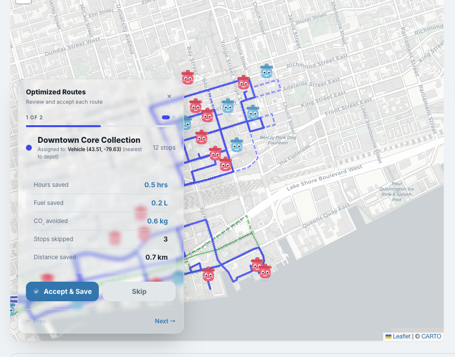
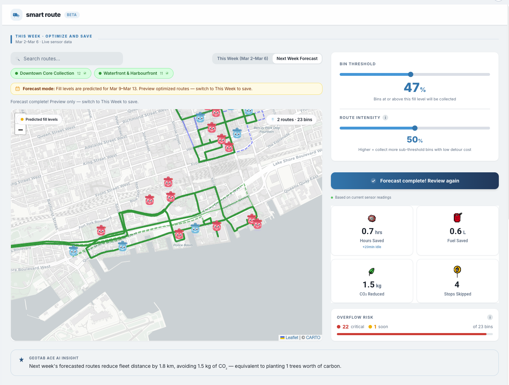

<div align="center">

# SmartRoute

### Dynamic Waste Fleet Optimization for Geotab

**Skip the bins that can wait. Optimize the rest. Write back to Geotab.**

[](https://drive.google.com/file/d/1lks6aoqf8iqPxwyqrcKnSQxKpxggEL3I/view?usp=sharing)
&nbsp;
[](https://github.com/fhoffa/geotab-vibe-guide)

</div>

---

## The Problem

Garbage trucks run fixed routes — same bins, same day, every week. They stop at half-empty bins while missing overflowing ones. A Stockholm pilot cut collection stops by **80%** just by only servicing bins that actually needed it. Edinburgh Council reduced collection costs by **30%** across 11,000 bins with smart sensors.

Most fleets don't have sensors yet. And those that do are locked to one vendor. **SmartRoute works either way.**

---

## Screenshots

**Review & Accept — floating overlay shows route metrics + nearest Geotab vehicle assignment**



**Dashboard — Next Week Forecast mode with Geotab Ace AI insight**



---

## What We Built

### This Week — Live Optimization

- **Load routes** from Geotab (`Get.Route`, `Get.Zone`) — search, add multiple, see bins color-coded by fill level
- **Bin threshold slider** — bins below this fill level are candidates to skip
- **Route intensity slider** — controls how aggressively sub-threshold bins get re-inserted if they're cheap to add
- **Optimize** — Clarke-Wright Savings + OR-Opt runs client-side; skips unnecessary stops
- **Review overlay** — floating panel on the map with before/after metrics, vehicle assignment (nearest Geotab vehicle to depot via Haversine), Accept/Discard
- **Accept** — writes optimized route back to Geotab (`Add.Route`, `RoutePlanItems`, Zones); drivers see it in their GO app
- **Stats** — stops skipped, km saved, fuel saved, CO₂ avoided, hours saved (incl. ~5 min idle per skipped stop)
- **Geotab Ace** — natural language fleet insight generated from optimization results
- **Cost report** — editable fuel/driver/CO₂ assumptions → weekly + annual savings, copy to clipboard

### Next Week — Forecast Mode

- **Week toggle** — "This Week" (live sensor data) vs "Next Week Forecast" (predicted fill levels)
- **Projected fill** — `currentFill + fillRatePerDay × daysToNextMonday` per bin
- **Forecast optimization** — same algorithm on projected bins; stored separately so this week's accepted routes are never overwritten
- **Preview only** — no Accept button; look-ahead for capacity planning and driver scheduling
- **Day-of-week summary** — "Mon 4 · Tue 2 · Wed 1 · Thu 5 · Fri 3" bins hitting threshold each weekday

### Bin Fill Predictions

- **Per-bin model** — `fillRatePerDay`, `daysUntilThreshold`, `predictedThresholdDate` from collection history in AddInData
- **Recency-weighted** — exponential decay 0.8; fleet-wide fallback for bins with insufficient data
- **Critical / Soon / On track** — grouped by urgency (≤2 days, ≤5 days, on track)
- **Highlight on map** — pulse critical bins on the Leaflet map
- **Action badges** — "Collect Mon/Tue", "Collect mid-week", etc. per bin
- **Estimated time** — "~45 min to collect 5 critical bins"

### Sensor-Agnostic Design

| Scenario | What they have | SmartRoute value |
|----------|----------------|-----------------|
| No sensors | Geotab only | Route sequence optimization — 10–15% savings immediately |
| No sensors | Geotab + driver feedback | Learn fill patterns over time, build history |
| Partial sensors | Some bins smart | Hybrid — sensor where available, infer elsewhere |
| Full sensors | Bigbelly / Sensoneo | Threshold-based skip logic — 20–40% savings |

**Works on day one. No vendor lock-in. No hardware required.**

### UX

- **6-step onboarding tour** — guides new fleet managers through search, week toggle, threshold, optimize, predictions, and forecast
- **Teal/navy palette** — modern, accessible
- **Animated stat icons** — clock, fuel, CO₂, stops
- **Map auto-zoom** — focuses on selected route when cycling the review overlay
- **Accepted routes** — chips and polylines turn green; toast confirmation

---

## Algorithm

**Files:** `backend/smartroute-algo.js` · `addin/src/services/algorithm.ts`

1. **Split by threshold** — Mandatory bins (`fillLevel >= threshold`) vs candidates
2. **Clarke-Wright Savings** — `saving = depot→i + depot→j - i→j` for every pair; greedy merge by highest savings; capacity 10 bins per route
3. **OR-Opt** — Move segments of 1–3 bins to other positions; accept if total distance decreases
4. **Selective insertion** — Sub-threshold: `netValue = fillLevel - alpha × normalizedInsertionCost`; insert when `netValue > 0`; `alpha = intensity × 3`
5. **Metrics** — km saved, fuel (0.3 L/km), CO₂ (2.68 kg/L), hours (driving at 25 km/h + 5 min per bin + 5 min idle per skipped stop)

---

## Quick Start

### Option A: GitHub-hosted (recommended)

1. **Get Geotab credentials:** [Create a free demo database](https://my.geotab.com/registration.html)
2. **GitHub Pages:** Push this repo → Settings → Pages → Deploy from `main`
3. **Install the Add-In:**
   - Edit `addin/smartroute-config.json`: set `url` to `https://<username>.github.io/<repo>/addin/dist/index.html`
   - MyGeotab → User profile → Administration → System Settings → Add-Ins → Enable "Allow unverified Add-Ins" → New Add-In → paste config → Save
4. **Refresh** and find "SmartRoute" in the sidebar

### Option B: Embedded (no hosting needed)

1. Copy the contents of `addin/smartroute-embedded-config.json`
2. MyGeotab → Add-Ins → New Add-In → paste → Save

### Build

```bash
cd addin
npm install
npm run build   # output → addin/dist/
```

Commit `addin/dist/` when deploying to GitHub Pages.

### Seed Demo Data (Toronto)

```bash
node scripts/seed-demo-routes.js
```

Creates Zones + Route with RoutePlanItems in your Geotab DB. Refresh the Add-In to see them.

> The Add-In ships with fallback synthetic routes (Downtown West, Midtown East, Waterfront Loop) — no seeding required for a quick demo.

---

## Tech Stack

| Layer | Technology |
|-------|------------|
| Frontend | React 18, Vite, TypeScript, Tailwind |
| Map | Leaflet, react-leaflet, OSRM road polylines |
| Algorithm | Clarke-Wright + OR-Opt (ES5, `backend/smartroute-algo.js`) |
| Prediction | Recency-weighted fill rate, fleet fallback |
| Geotab | `api.call()` — Route, Zone, RoutePlanItem, DeviceStatusInfo, AddInData |
| AI | Geotab Ace API for fleet insight |
| Deployment | GitHub Pages → `addin/dist/` |

---

## Project Structure

```
smartroute/
├── addin/                    # Geotab Add-In (React + Vite)
│   ├── src/
│   │   ├── pages/Index.tsx         # Main dashboard, week toggle, tour
│   │   ├── hooks/useSmartRoute.ts  # State, API orchestration, forecast
│   │   ├── services/
│   │   │   ├── algorithm.ts        # Wrapper for SmartRouteAlgo
│   │   │   ├── geotabApi.ts        # Route, Zone, DeviceStatusInfo, Ace
│   │   │   └── routing.ts          # OSRM polyline fetch
│   │   └── components/             # Map, overlays, modals
│   ├── dist/                       # Built output → GitHub Pages
│   ├── smartroute-config.json      # External hosted config
│   └── smartroute-embedded-config.json
├── backend/
│   └── smartroute-algo.js          # Clarke-Wright, OR-Opt, prediction (ES5)
├── data/
│   ├── bin-data.json               # Per-route fill + collection logs
│   └── toronto-route-demo.json     # Toronto zones for seed script
├── docs/
│   ├── avni-prompts.md             # All prompts used for this project
│   ├── API_KEYS.md
│   ├── ROUTE_SCHEMA.md
│   └── VISION.md
└── scripts/
    ├── explore-db.js               # List devices, zones, routes
    └── seed-demo-routes.js         # Create Toronto demo route
```

---

## Demo

Watch the 3-minute demo: [Google Drive](https://drive.google.com/file/d/1lks6aoqf8iqPxwyqrcKnSQxKpxggEL3I/view?usp=sharing)

---

## References

- [geotab-vibe-guide](https://github.com/fhoffa/geotab-vibe-guide) — Add-In patterns, API reference, hackathon ideas
- [docs/avni-prompts.md](docs/avni-prompts.md) — All prompts used for this project
